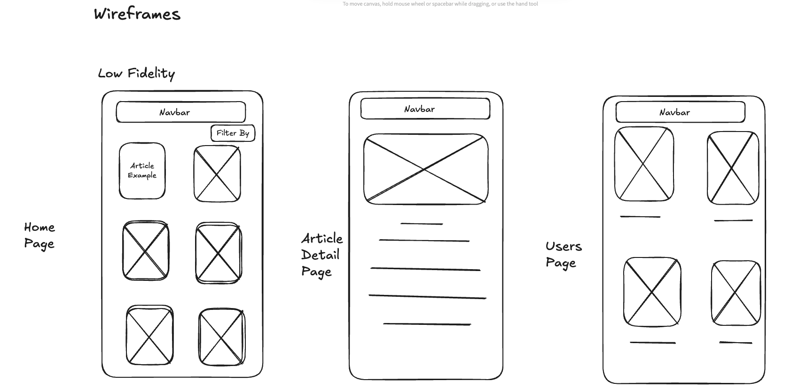
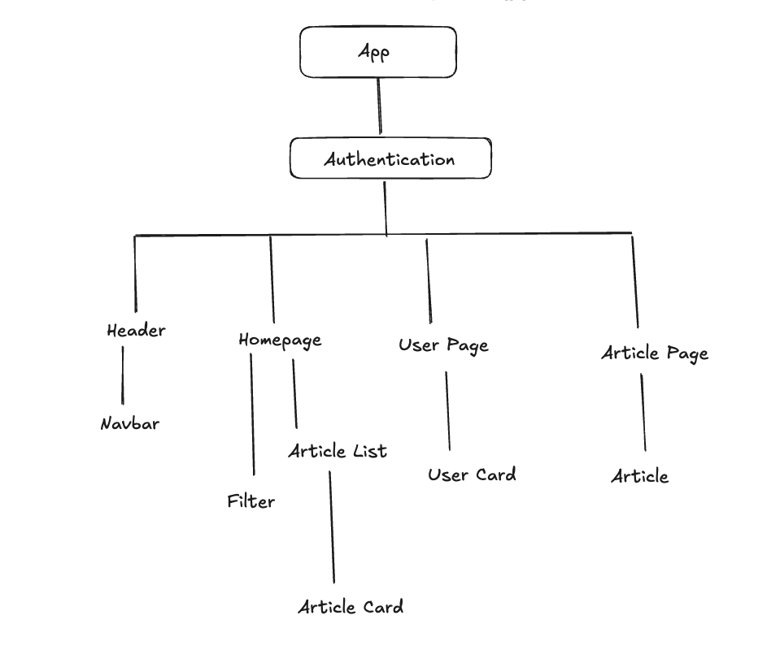

# Wai Hleng Swe's nc-news App
<!-- ABOUT THE PROJECT -->
## About The Project

This project defines the frontend part of the nc-news project that was written with retrospect to the backend part that was written initially before. This web app however fetches API data from the hosted API of nc-news. The frontend is written with React.js with TailwindCSS and setup with Vite. 

### Built With

This section acknowledges the major frameworks/libraries used to bootstrap my project.
* [![React][React.js]][React-url]

### In this project directory you can run

1. Install required dependencies
   ```sh
   npm i
   ```
2. Change directory to the frontend folder of this project
   ```sh
   cd nc-news
   ```
3. Runs the app in development mode.
   ```sh
   npm run dev
   ```
4. Open [http://localhost:5173](http://localhost:5173) to view it in the browser.

The page will reload if you make edits.

<!-- WEBSITE DETAILS -->
## Project Images:



<!-- CONTACT -->
## Made By:

Wai Hleng Swe

Project Link: [https://github.com/BigSlayWai/nc-news](https://github.com/BigSlayWai/nc-news)

<!-- MARKDOWN LINKS & IMAGES -->
[React.js]: https://img.shields.io/badge/React-20232A?style=for-the-badge&logo=react&logoColor=61DAFB
[React-url]: https://reactjs.org/